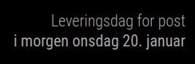

## MMM-PostDelivery-Norway
A MagicMirror2 module for showing the next post delivery day for your zip code in Norway

Statement from the Norwegian Postal Service in 2020:

"The number of letters sent has fallen from the peak year in 1999 until today by 70%. More specifically, 
this means that the postman delivers on average only 3 letters per mailbox a week. It is therefore not sustainable or 
financially justifiable to maintain five days of postal delivery, 
and we therefore move to delivery every other day from 7 July 2020."

### Dependencies
  * A [MagicMirror<sup>2</sup>](https://github.com/MichMich/MagicMirror) installation

### Installation

In your terminal, go to your MagicMirror's module folder:
````
cd ~/MagicMirror/modules
````

Clone this repository and install the dependencies:
````
git clone https://github.com/reidarw/MMM-PostDelivery-Norway.git
````

Install dependencies
```
npm install
```

Add the module to the modules array in the `config/config.js` file
and insert your own zip code. 

```
 {
    module: 'MMM-PostDelivery-Norway',
    position: 'top_left',
    config: {
        zipCode: 7033
    }
 },
```

## Optional config
| **Option** | **Description** |
| --- | --- |
| `header` | Alternative header. Default: "Leveringsdag for post" |
| `zipCode` | Your zipcode in Norway. Default: 7033 |
| `numberOfDays` | Number of days to display. Maximum 6. Default: 1 |

## Sample screenshot


